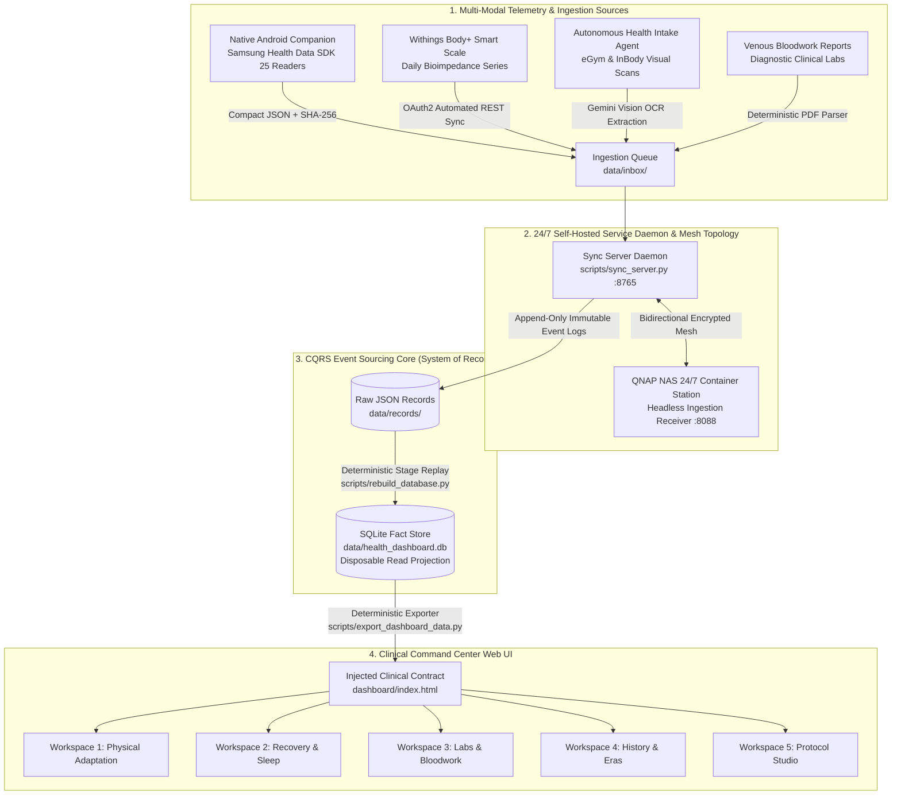
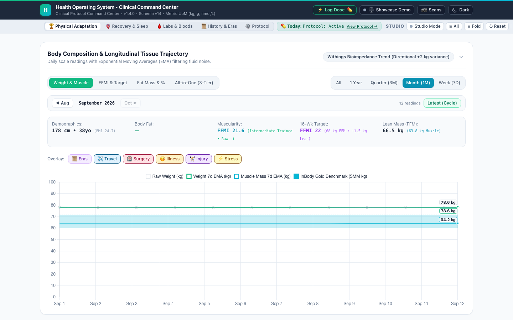
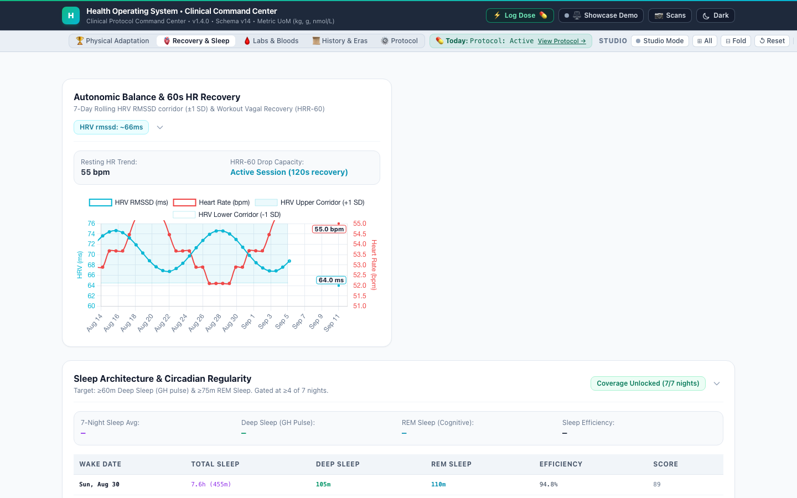
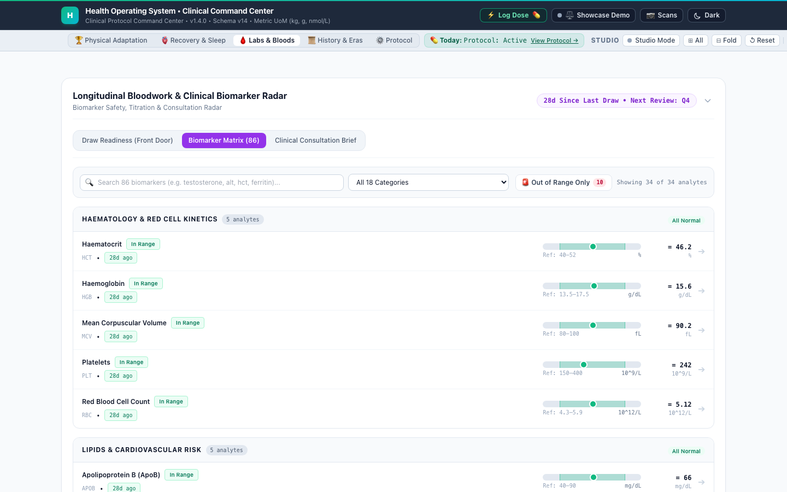
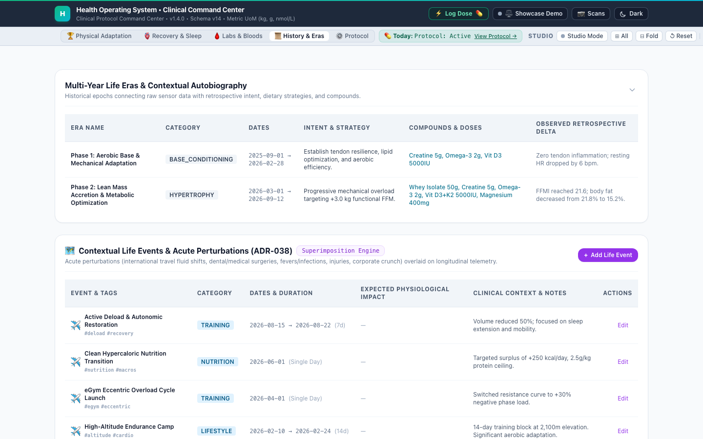
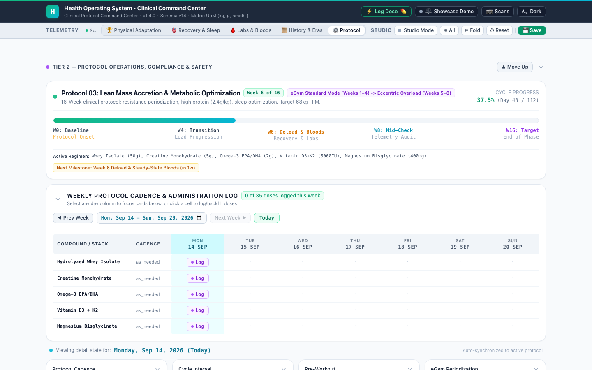
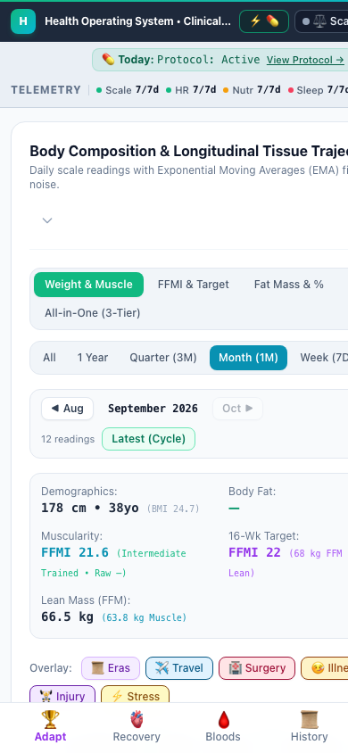

# Health OS — Self-Hosted Personal Clinical Command Center

[](https://eneasf.github.io/health-os/)
[](LICENSE)
[](docs/SYSTEM_DESIGN.md)
[](docs/DASHBOARD_SPECIFICATION.md#6-architectural-decision-records-adr)
[](#-privacy-sanitization--synthetic-demo-data)

> **Personal Project Notice:** This is an independent personal project developed entirely in a personal capacity during spare time, on personal equipment. It has no affiliation with, connection to, or endorsement from my employer, nor does it use any proprietary employer resources or confidential information.
>
> **Medical & Clinical Disclaimer:** Health OS is an engineering showcase and software reference implementation developed strictly for personal tracking and bio-optimization research. It is **not** a medical device, does not provide medical advice, diagnosis, or treatment recommendations, and must never be used to make clinical decisions or adjust medication regimens. Always consult a qualified physician or licensed healthcare provider regarding any health condition, biomarker interpretation, or medical treatment.
>
> **Note on Repository History:** This repository is a sanitized public showcase and architectural reference. The production system operates privately with live personal biometric and clinical event streams; this public repository receives curated release snapshots containing 100% synthetic demonstration data.

---

## 💡 The Problem: Fragmented, Opaque Health Data

Most consumer health technology treats you as a consumer of proprietary scores rather than the owner of your clinical data:
- **Walled-Garden Fragmentation:** Smart scale measurements live in one cloud, continuous heart rate and sleep in another, gym machine telemetry in a third, and clinical bloodwork PDFs in your email.
- **Black-Box Metrics:** Critical biomarkers are aggregated into opaque proprietary scores (e.g. *"Daily Readiness: 78"*) with zero visibility into the underlying mathematical models or raw data.
- **Fabricated Continuity:** When data is missing, commercial apps routinely interpolate curves or project baseline demonstration schedules across gaps, creating dangerous false reassurance.
- **Third-Party Cloud Exposure:** Sensitive longitudinal biometrics are hosted on commercial SaaS infrastructure where privacy policies change and data is monetized.

---

## 🛡️ The Solution: Sovereign, Self-Hosted Infrastructure

**Health OS** is a self-hosted, private-first personal health operating system and clinical command center designed for longitudinal bio-optimization and protocol management:

1. **Sovereign & Self-Hosted:** All data is stored on hardware you control; the one exception is cropped scan images sent to the Gemini Vision API for OCR (see *Autonomous Health Intake & Gemini Vision OCR Governance* below). Ingestion runs 24/7 on a private QNAP NAS container; client applications synchronize over an encrypted private mesh network (Tailscale) with zero public open ports.
2. **Clinical Null-Honesty ([ADR-016](docs/HANDOVER.md#2-master-decision-index-adr-summary)):** If data was not logged, it renders as an explicit `null` / `unlogged` state. Missing periods are never masked with fabricated lines or demonstration schedules.
3. **Pure Laboratory Anchoring ([ADR-023](docs/HANDOVER.md#2-master-decision-index-adr-summary)):** Telemetry analysis across 2.47M historical samples confirmed that resting heart rate and autonomic metrics do not correlate with haematocrit ($r = +0.084, p = 0.794$). Blood surveillance is strictly anchored to venous laboratory draws; speculative wearable proxies are rejected.
4. **First-Class Coverage Denominators:** Every clinical calculation displays its backing sample size and completeness denominator (e.g. *"from 86 of 90 complete days"*). Sparse data streams display behavioral banners rather than misleading interpolations.
5. **Event Sourcing with CQRS ([ADR-028](docs/HANDOVER.md#2-master-decision-index-adr-summary)):** Raw append-only JSON event files are the sole system of record. SQLite is strictly a disposable read projection that can be rebuilt deterministically from raw logs in seconds.

---

## 🏗️ End-to-End System Architecture

Health OS is structured across four decoupled tiers adhering strictly to **Event Sourcing with CQRS**:



---

## 🖥️ Clinical Command Center (Visual Tour)

The frontend command center is a modular, high-density clinical dashboard built with zero build steps or heavyweight frameworks, designed to run both offline via `file://` and live against the local sync server daemon.

👉 **[Launch the Live Interactive Demo on GitHub Pages](https://eneasf.github.io/health-os/)**

### Workspace 1: Physical Adaptation Triad
The primary landing workspace ([ADR-026](docs/HANDOVER.md#2-master-decision-index-adr-summary)) unifies **Body Composition (Outcome)**, **Nutrition (Fuel)**, and **Exercise (Stimulus)**:
- **Body Composition 12-Series Engine**: Unified 0–95 kg mass grounding ([ADR-009](docs/HANDOVER.md#2-master-decision-index-adr-summary)), 7-day and 30-day EMAs, dual physiological corridors for fat and skeletal muscle mass, height-normalized FFMI ([Kouri et al. 1995](docs/HANDOVER.md#2-master-decision-index-adr-summary)), and InBody benchmark diamonds.
- **Nutritional Coverage & Fueling**: Complete-day partitioning with explicit sample denominators (*"from 86 of 90 complete days"*), caloric balance, and protein/kg ratios.
- **Mechanical Exercise Stimulus**: 7-day workout cadence, 15-workout interactive pager, intra-session HR curves, 5 cardiac zones, HRR-60 recovery drops, and eGym multi-set cards.



---

### Workspace 2: Autonomic & Recovery Surveillance
Dedicated autonomic monitoring without speculative clinical proxies ([ADR-023](docs/HANDOVER.md#2-master-decision-index-adr-summary)):
- **Resting Heart Rate & HRV Corridor**: 7-day rolling normative corridor, resting HR trends, and autonomic stress tracking.
- **Cardiovascular HRR-60 Drop**: High-resolution 60-second recovery curves measuring post-exercise parasympathetic reactivation.
- **Coverage-Gated Sleep Architecture**: Strictly gated behind a rolling $\ge 4$ of 7 nights requirement ([ADR-016](docs/HANDOVER.md#2-master-decision-index-adr-summary)) to prevent misleading interpolation through sparse periods; renders Deep, REM, Light, and Awake stages with nocturnal dip percentages when complete.



---

### Workspace 3: Longitudinal Bloodwork & Biomarker Matrix
Longitudinal venous bloodwork comprising 86 analytes across 18 physiological systems ([ADR-022](docs/HANDOVER.md#2-master-decision-index-adr-summary)):
- **Bullet Graph Matrix**: Discrete scatter points (no fabricated continuous lines across test gaps) with lab-reported reference intervals, canonical unit conversions, and priority triage sorting.
- **Clinical Consultation Brief**: Automated physician summary formatting out-of-range metrics and multi-year trajectories across international SI Metric and Conventional unit standards.
- **Draw Readiness Gate**: Evaluates prerequisite fasting and panel completeness before ordering scheduled draws.



---

### Workspace 4: History & Contextual Life Events
Multimodal physiological chart superimposition ([ADR-038](docs/HANDOVER.md#2-master-decision-index-adr-summary)):
- **Contextual Life Events**: Interleaved category bands (Protocols, Training, Lifestyle, Nutrition, Travel) and frosted glyph pins super-imposed directly onto historical biometric curves.
- **Life Eras Curator**: High-level macro-cycle tracking capturing intent, compound stacks, nutritional strategies, and empirical learnings across years.



---

### Workspace 5: Protocol Studio & Active Regimens
Dynamic protocol management and adherence operations ([ADR-037](docs/HANDOVER.md#2-master-decision-index-adr-summary)):
- **Multi-Vector Protocol Manifests**: Event-sourced definitions of active regimens, compound dosages, delivery routes, and safety redlines.
- **Monday-Start Adherence Matrix**: Weekly adherence ledger with dot/pill/dash completion states, fast affirmative attestation modals, and retroactive backfilling.



---

### Mobile Ergonomics & Bottom Navigation Dock
Fully responsive mobile architecture ([ADR-025](docs/HANDOVER.md#2-master-decision-index-adr-summary), [ADR-035](docs/HANDOVER.md#2-master-decision-index-adr-summary)):
- Root overflow-x containment, adaptive Chart.js canvas isolation, and sticky frozen columns for complex matrix tables.
- Fixed 5-tab **Mobile Bottom Navigation Dock** with 1-tap workspace transitions meeting WCAG 2.2 touch-target standards ($\ge 44\text{px}$).

<p align="center">
  
</p>

---

## 🤖 Engineering Governance & Agentic Architecture

Health OS was engineered under a formal, human-directed agentic development framework:

- **System Architect & Product Owner (Eneas Faleiros):** Defined domain boundaries, clinical safety invariants, mathematical equations, data contracts, and architectural decisions.
- **Autonomous Specialist AI Subagents:** Assigned disjoint, non-overlapping tasks under strict 3-tier routing ([ADR-024](docs/HANDOVER.md#2-master-decision-index-adr-summary)):
  - *Tier 1 (Mechanical Execution):* Deterministic unit tests, JSON formatting, spreadsheet parsing.
  - *Tier 2 (Standard Engineering):* SQLite migrations, CQRS replay scripts, data pipelines.
  - *Tier 3 (Complex Architecture & UI):* Multi-workspace state management, SVG charting math, clinical protocol rules.
- **39 Architectural Decision Records (ADRs):** Every structural convention, UI equation, and pipeline trade-off is formally documented in [`docs/DASHBOARD_SPECIFICATION.md`](docs/DASHBOARD_SPECIFICATION.md#6-architectural-decision-records-adr).
- **Automated 7-Gate Verification Suite:** Every contribution must pass all 7 automated gates in `scripts/run_quality_gates.py` before merge (JavaScript syntax, HTML data hook preservation, ingestion assertions, schema idempotency, live DB write safety, exporter byte-determinism, and tree cleanliness).

---

## 📱 Native Android Companion App

The companion app ([`android/`](android/)) runs as a low-overhead background collector and bedside attestation client:

- **Kotlin 2.0 & Jetpack Compose**: Modern reactive UI built with Material 3 tokens.
- **Samsung Health Data SDK (v1.1.0)**: Reads 25 continuous health data types (Heart Rate, HRV, Sleep Sessions, Blood Oxygen, eGym Workouts, Body Composition, Nutrition).
- **Two-Sided SHA-256 Hash Contract ([ADR-017](docs/HANDOVER.md#2-master-decision-index-adr-summary))**: Calculates compact SHA-256 hashes across payload spans to guarantee cryptographic transmission integrity before Mac inbox ingestion.
- **1-Tap Quick Protocol Dose Attestation ([ADR-039](docs/HANDOVER.md#2-master-decision-index-adr-summary))**: Discovers active compounds via `GET /api/protocol/active`, logs affirmative compliance in 1 tap, and supports offline queueing with automatic backoff sync.

---

## 📁 Repository Map

```
├── AGENTS.md                                          # Mandatory Git, Documentation & Medical Safety Rules
├── README.md                                          # Master System Blueprint & Documentation Front Door
├── android/                                           # Native Kotlin Companion App (Samsung Health SDK)
│   ├── app/src/main/java/.../HealthDataCollector.kt   # 25-Type SDK Reader & Payload Packager
│   └── app/src/main/java/.../DoseAttestationScreen.kt # 1-Tap Protocol Dose Attestation UI
├── config/                                            # Configuration templates (gitignored credentials)
├── dashboard/                                         # Frontend Clinical Command Center
│   ├── index.html                                     # Master UI Shell & Injected Data Hook
│   └── js/                                            # Modular ECMAScript Domain Engines
│       ├── app.js                                     # Bootloader & Sync State Orchestrator
│       ├── charts.js                                  # 12-Series Canvas Engine & Dual Corridors
│       ├── matrix.js                                  # Weekly Adherence Matrix & Dose Modal
│       ├── bloodwork.js                               # 18-Category Lab Matrix & Consultation Brief
│       ├── widgets.js                                 # Movable/Collapsible Studio Engine
│       ├── responsive.js                              # Adaptive Canvas Isolation & Reframing
│       ├── exercise.js                                # Mechanical Workouts, Zones & BioAge
│       ├── life_events.js                             # Multimodal Chart Superimposition
│       ├── protocol_studio.js                         # Interactive Protocol Manifest Manager
│       └── theme.js                                   # Clinical Light (#F8FAFC) / Dark Theme
├── data/
│   ├── health_dashboard.db                           # Disposable SQLite Fact Store (~516 MB, gitignored)
│   ├── inbox/                                        # Incoming push queue from Android Companion
│   └── records/                                      # Append-Only Event Sourcing System of Record
│       ├── interventions/                            # Raw JSON Dose Attestations
│       ├── protocols/                                # Event-Sourced Regimen Manifests
│       ├── events/                                   # Historical Life Events
│       ├── withings/                                 # Scale Bioimpedance Snapshots
│       └── samsung_health/                           # Continuous Daily Telemetry Snapshots
├── docs/                                             # Authoritative Specifications & Milestones
│   ├── DASHBOARD_SPECIFICATION.md                    # Clinical UI Blueprint & 39 ADR Logs
│   ├── HANDOVER.md                                   # Master System Map, Schema Versions & Handover
│   ├── SYSTEM_DESIGN.md                              # Core Pipeline Architecture & Deduplication
│   ├── images/                                       # Light-Mode Visual Showcase Assets
│   └── milestones/                                   # 25 Dedicated Milestone Slice Records (M1–M25)
├── protocols/                                        # Clinical Protocols & Pharmacology Guidelines
└── scripts/                                          # Zero-Dependency Python Automation Workers
    ├── service_manager.sh                            # LaunchAgent Daemon Controller (Port 8765)
    ├── sync_server.py                                # Local Fast-HTTP Sync & Ingestion API Server
    ├── export_dashboard_data.py                      # Deterministic JSON Exporter & Data Injector
    ├── rebuild_database.py                           # Clean SQLite Replay Engine from Raw Event Logs
    ├── run_quality_gates.py                          # Strict Quality Gate Verification Suite
    ├── export_public_showcase.py                      # Automated Showcase Exporter & Leak Scanner
    ├── sync_from_nas.sh                              # Bidirectional Dev Sync from QNAP NAS
    └── deploy_to_nas.sh                              # Production Deploy Script with Rebuild Safety
```

---

## 🛠️ Developer & Operator Guide

### 1. Managing the Background Service Daemon
The local synchronization server runs as a macOS LaunchAgent daemon binding to port **8765**:

```bash
# Check service status and health probe
./scripts/service_manager.sh status

# Start, stop, or restart the daemon
./scripts/service_manager.sh start
./scripts/service_manager.sh restart
./scripts/service_manager.sh stop
```

### 2. Exporting Dashboard Data & Local Launch
Health OS uses a deterministic export pipeline ([ADR-013](docs/HANDOVER.md#2-master-decision-index-adr-summary)). Running the exporter updates `dashboard/dashboard_data.json` and injects data directly into `<script id="injected-dashboard-data">` in `dashboard/index.html` without dirtying git history:

```bash
# Export the latest database projection to the dashboard
python3 scripts/export_dashboard_data.py

# Open the dashboard directly in your browser
open dashboard/index.html
```

### 3. Rebuilding the Database from Raw Events (CQRS Replay)
SQLite is strictly a disposable read projection. To rebuild the entire database from raw append-only JSON files ([ADR-027](docs/HANDOVER.md#2-master-decision-index-adr-summary), [ADR-028](docs/HANDOVER.md#2-master-decision-index-adr-summary)):

```bash
# Stop daemon locks, purge temporary DB files, and replay all events
./scripts/service_manager.sh stop
python3 scripts/rebuild_database.py --clean
./scripts/service_manager.sh start
```

### 4. Running the Quality Verification Gates
Every contribution must pass the strict quality gates runner:

```bash
python3 scripts/run_quality_gates.py --strict
```

---

## 🔒 Privacy, Sanitization & Telemetry Governance

To guarantee absolute medical privacy while providing a complete, working reference implementation:

- **Clean-Room Repository:** The public repository is initialized fresh with no historical commits containing private biometrics or internal network paths.
- **Procedural Physiology Synthesis:** Demo data is generated by [`scripts/generate_mock_dashboard.py`](scripts/generate_mock_dashboard.py) using mathematical models and clinical equations ("Alex Rivers", 38yo male, 178 cm, 78.4 kg). It never reads from or de-identifies the real personal database.
- **Automated Leak Scanner:** The export pipeline ([`scripts/export_public_showcase.py`](scripts/export_public_showcase.py)) enforces a recursive regex pre-flight check asserting 0 private hostnames, tokens, credentials, or personal identifiers before any release snapshot is created.

### 👁️ Autonomous Health Intake & Gemini Vision OCR Governance
Health OS automates ingestion of analog physical health data (such as gym machine consoles and printed body composition sheets) using an intake agent powered by multimodal vision models (Google Gemini Vision API):
- **Data Boundary & Isolation:** Only the cropped image of the equipment display or medical report is transmitted to the vision API.
- **Zero PII Leakage:** No personal identifiers, user names, patient demographics, device serials, or account tokens are ever attached to OCR API requests. Extraction prompts instruct the model to return strict, deterministic JSON key-value pairs representing raw physiological telemetry (e.g. resistance kg, reps, bioimpedance ohms, phase angle).
- **Immutable Raw Storage:** Extracted JSON data is validated against the CQRS schema and committed to append-only logs in `data/records/` before projection into SQLite.
- **Self-Hosted Fallback:** The ingestion architecture supports drop-in replacement with local, on-premise vision models (e.g. Ollama / LLaVA) running directly on the QNAP NAS or local server for zero-cloud environments.

---

## 📚 Master Documentation Links

- 🏛️ **[System Architecture & Design Document](docs/SYSTEM_DESIGN.md)**: Master data pipelines, ER diagrams, and deduplication specifications.
- 📐 **[Dashboard Specification & ADR Log](docs/DASHBOARD_SPECIFICATION.md)**: Authoritative clinical UI rules, Chart.js mathematics, and complete Architectural Decision Records (`ADR-001` through `ADR-039`).
- 🗺️ **[System Master Map & Handover Guide](docs/HANDOVER.md)**: Active schema contracts, milestone indices, and open work registers.
- 🤖 **[Agent Guidelines & Repository Protocols](AGENTS.md)**: Mandatory git hygiene standards, model tier routing, and database safety rules.
- 📜 **[Milestone Slice Archives](docs/milestones/)**: Historical design blueprints, testing notes, and verification logs for all 25 completed milestones.
