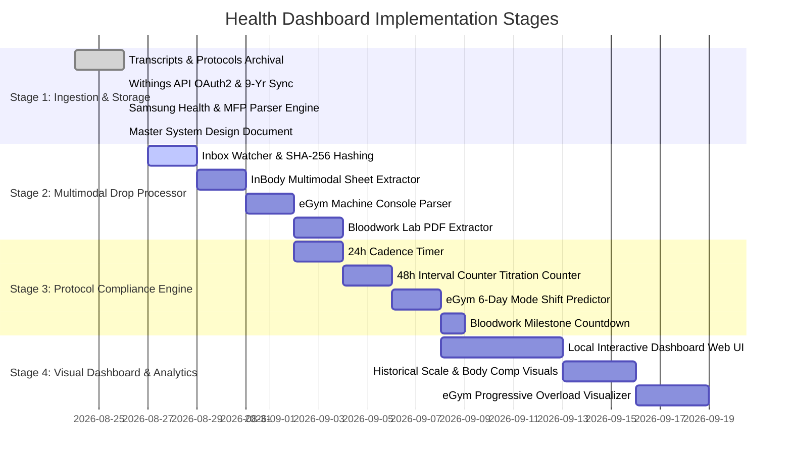

# System Architecture & Data Engineering Design Document

**Project:** My Health Dashboard  
**Author:** Eneas  
**Version:** 1.0.0  
**Date:** 2026-08-26  
**Status:** Approved & Under Active Development  

---

## 1. Executive Summary & Goals

The **My Health Dashboard** is a local-first, privacy-focused health and bio-optimization tracking system. It integrates disparate data streams—including automated smart scale APIs, on-device mobile health exports, manual gym machine screens, clinical bioimpedance sheets, and bloodwork lab reports—into a unified, deduplicated data store.

### Core Objectives:
1. **Multi-Modal Data Unification:** Support automated API sync (Withings), file export parsing (Samsung Health / MyFitnessPal), and OCR/multimodal extraction (InBody, eGym machine screens, lab PDFs).
2. **Deterministic Deduplication:** Guarantee zero duplicate records across recurring cumulative exports and multi-device overlap.
3. **Local-First & Private:** SQLite and JSON data stores reside entirely on the local machine with zero external cloud dependencies.
4. **Bio-Optimization Surveillance:** Continuous surveillance against clinical safety ceilings (Hematocrit $\le 54\%$, sensitive LC-MS/MS estradiol tracking, resting HR recovery, and tendon shear protection).

---

## 2. High-Level System Architecture

```mermaid
graph TD
    subgraph DataSources["1. Multi-Source Ingestion Layer"]
        S1[Withings Smart Scale Body+] -->|OAuth2 REST API| I1[scripts/sync_withings.py]
        S2[Samsung Health / MyFitnessPal] -->|ZIP / CSV Export| I2[scripts/ingest_samsung_health.py]
        S3[Gym InBody 770 / 570] -->|Photo / PDF Drop| I3[Multimodal InBody Parser]
        S4[eGym Circuit Screen Photos] -->|Photo Drop| I4[Multimodal eGym Parser]
        S5[Venous Bloodwork Lab Reports] -->|PDF Drop| I5[Lab Report PDF Parser]
    end

    subgraph Staging["2. Staging & Inbox Queue"]
        I2 & I3 & I4 & I5 --> B[data/inbox/]
    end

    subgraph ProcessingEngine["3. Ingestion, Extraction & Deduplication Engine"]
        B --> P1[SHA-256 File Hash Check]
        P1 --> P2[Extraction & Validation]
        P2 --> P3[Primary Key & Composite UPSERTs]
        P3 --> P4[Hierarchy of Truth Resolution]
    end

    subgraph StorageLayer["4. Dual Storage Layer"]
        P4 --> DB[(SQLite: data/health_dashboard.db)]
        P4 --> JSON[JSON Event Logs: data/records/]
        I1 --> DB
        I1 --> JSON
    end

    subgraph Archival["5. Archival & Auditability"]
        P4 --> ARC[archive/{source}/{YYYY-MM}/]
        P2 -->|Uncertain / Low Confidence| NR[data/needs_review/]
    end

    subgraph Presentation["6. Presentation & Analytics (Upcoming)"]
        DB --> UI[Interactive Health Dashboard Web UI]
        DB --> REP[Automated Markdown Cycle Summaries]
    end
```

---

## 3. Storage Layer & Database Schema

The database resides in a single, robust SQLite database file at [`data/health_dashboard.db`](file:///home/user/Documents/My%20health%20dashboard/data/health_dashboard.db).

### Entity Relationship & Table Specifications

```mermaid
erDiagram
    USERS ||--o{ WITHINGS_READINGS : has
    USERS ||--o{ DAILY_NUTRITION : logs
    USERS ||--o{ FOOD_LOG_ITEMS : contains
    USERS ||--o{ HEART_RATE_RECORDS : tracks
    USERS ||--o{ SLEEP_SESSIONS : sleeps
    USERS ||--o{ EXERCISE_SESSIONS : performs
    USERS ||--o{ INBODY_SCANS : records
    USERS ||--o{ EGYM_WORKOUTS : logs
    USERS ||--o{ BLOODWORK_BIOMARKERS : measures
    USERS ||--o{ PROTOCOL_LOGS : adheres

    USERS {
        text id PK
        text name
        text withings_user_id
        int age
        text gender
        int active
        datetime created_at
    }

    WITHINGS_READINGS {
        text id PK "Withings grpid"
        text user_id FK
        text user_name
        datetime timestamp
        text date
        real weight_kg
        real fat_free_mass_kg
        real fat_ratio_pct
        real fat_mass_weight_kg
        real muscle_mass_kg
        real hydration_tbw_kg
        real bone_mass_kg
        real pulse_wave_velocity_ms
        real heart_rate_bpm
        real visceral_fat_index
        text raw_json
    }

    DAILY_NUTRITION {
        text date PK
        text user_id FK
        text user_name
        real calories_kcal
        real protein_g
        real carbs_g
        real fat_g
        real saturated_fat_g
        real fiber_g
        real sugar_g
        real sodium_mg
        real potassium_mg
        int meal_items_count
        int is_complete "1 if >1200 kcal & >=3 foods"
        text logging_quality "complete | partial"
        datetime updated_at
    }

    FOOD_LOG_ITEMS {
        text id PK "Samsung datauuid"
        text user_id FK
        text user_name
        datetime timestamp
        text date
        text meal_name
        text food_name
        int meal_type
        real amount
        real calories_kcal
        real protein_g
        real carbs_g
        real fat_g
        real fiber_g
        real sodium_mg
    }

    SLEEP_SESSIONS {
        text id PK "Samsung datauuid"
        text user_id FK
        text user_name
        datetime start_time
        datetime end_time
        text wake_date "Indexed attribution date"
        real duration_minutes "Time in bed"
        real total_sleep_minutes "Total sleep duration"
        real deep_sleep_minutes "Delta-wave (Stage 40003)"
        real rem_sleep_minutes "Stage 40004"
        real light_sleep_minutes "Stage 40002"
        real awake_minutes "Stage 40001"
        real efficiency_pct
        real sleep_score
        text session_role "main_sleep | nap | fragment"
        int is_nap "1 if daytime nap (<180m, 08:00-20:00)"
        text sleep_type
        datetime updated_at
    }

    DAILY_SLEEP_SUMMARY {
        text wake_date PK
        text user_id FK
        int session_count
        int main_sleep_count
        int nap_count
        int fragment_count
        real total_duration_minutes
        real total_sleep_minutes
        real deep_sleep_minutes
        real rem_sleep_minutes
        real light_sleep_minutes
        real awake_minutes
        real avg_sleep_score
        real aggregate_efficiency_pct
    }

    INBODY_SCANS {
        text scan_id PK
        text user_id FK
        text test_date
        text test_time
        real weight_kg
        real skeletal_muscle_mass_kg
        real fat_free_mass_kg
        real body_fat_kg
        real body_fat_pct
        real phase_angle_deg
        real total_body_water_l
        real icw_l
        real ecw_l
        real ecw_ratio
        real bmr_kcal
        text raw_image_path
    }

    EGYM_WORKOUTS {
        text session_id PK
        text user_id FK
        text date
        text mode "Standard | Eccentric | Isokinetic | Adaptive"
        text exercise_name
        int set_number
        int reps
        real peak_load_kg
        real est_energy_exp_kcal
        text raw_image_path
    }

    BLOODWORK_BIOMARKERS {
        text entry_id PK
        text user_id FK
        text test_date
        int cycle_week "W0, W6, W16, W24"
        text biomarker_name "Fasting Glucose, HbA1c, ApoB, hsCRP, HCT..."
        real value
        text unit "nmol/L, pmol/L, %, g/dL"
        real ref_range_min
        real ref_range_max
        int flag_abnormal "0 or 1"
        text methodology "e.g. LC-MS/MS"
        text lab_provider "Clinical Laboratory C / Clinical Laboratory D"
        text report_pdf_path
    }
```



---

## 3A. Schema Evolution & Migration Log

The database is a **derived artefact**, rebuilt from `archive/` + `data/records/`. It is nonetheless versioned, because a silent schema drift makes a rebuild non-reproducible. Version lives in `PRAGMA user_version`; every change is recorded in the `schema_migrations` table by `record_migration()` in `scripts/ingest_samsung_health.py`.

| Version | Change | Rationale |
|---|---|---|
| 1 | Initial ingestion schema | — |
| 2 | `utc_offset`, `source`, `heart_rate_samples.exercise_id`, `daily_summary` | See below |
| 3 | `local_date` / `local_wake_date`; nutrition re-keyed onto the lived day | 2026-08-27: fixes the UTC-vs-local day defect below |
| 4 | `stress_records`, `stress_samples`, `hrv_records`, `hrv_samples`, dual storage | 2026-08-27: resolves F10a dual storage and adds stress + HRV parsers (1M+ samples) |

> ⚠️ **This log is append-only. Do not delete or condense earlier version sections when adding a new one.**
> Each entry records *why* a change was made; the v3 entry in particular is the only narrative record of the
> UTC-vs-local-day defect, and removing it invites the bug back. v2 and v3 were deleted in the v4 edit and
> restored from `git show HEAD~1`.

### v2 — 2026-08-27

Prompted by a profiling pass after the heart-rate sample tables landed (28k rows → 1.36M rows, 6 MB → 456 MB). The engine was never the constraint — a full scan of `heart_rate_samples` is 137 ms. Three schema gaps were.

**1. `utc_offset INTEGER` (signed minutes)** on `heart_rate_records`, `sleep_sessions`, `exercise_sessions`, `exercise_recovery`, `daily_nutrition`.

The source `time_offset` column was previously discarded, leaving every timestamp as naive local wall-clock. The history spans **six offsets** — 1,226 days at UTC+01:00, 625 at UTC+00:00, **269 at UTC−03:00**, plus UTC+02:00/+03:00/−02:00 — and **31 days contain records from more than one offset**. Without the offset a "day" is not always 24 hours, and elapsed time across a relocation cannot be computed from stored timestamps. The offsets exist only in the export, so this was recoverable now and not later.

Held on parent records only; sample rows reach theirs through `parent_id` / `recovery_id` rather than repeating the value 1.3M times.

> ⚠️ **Correction 2026-08-27.** This section originally described stored timestamps as "naive local wall-clock". They are **UTC**. Verified against the Samsung Health Data SDK — see `docs/HANDOVER.md` F7. Consequently `date` is a **UTC day**, not a local day, and `utc_offset` is stored but not yet applied anywhere. Every daily aggregate, `daily_summary` included, buckets on UTC days.

**2. `source TEXT`** on every fact table (`samsung_export` | `withings_api`).

No table previously recorded where a value came from. Tolerable for a dashboard, not for AI insight — *"resting HR rose in June"* is unanswerable without knowing which device or pipeline June came from. Also a prerequisite for the cross-source reconciliation in `docs/SAMSUNG_INGESTION.md` (gaps G5/G7), where the same fact can arrive from two writers.

**3. `heart_rate_samples.exercise_id TEXT`**, indexed.

Retrieving a workout's HR curve previously range-joined TEXT timestamps against every exercise session: **313 ms per workout**. With the link precomputed at ingest it is **0.1 ms**. Populated by `tag_samples_with_exercise()` using an in-memory sorted interval list with `bisect` — the equivalent SQL backfill took 117 s, the bisect pass takes seconds. ISO-8601 strings compare correctly as text, so no parsing is needed.

Note: 54 exercise sessions overlap in time. Each sample is assigned to the **latest session starting at or before it**, so overlapping sessions do not double-count. Verified: 0 samples tagged outside their session window.

**4. `daily_summary` — materialised daily rollup**, rebuilt at the end of every ingest by `rebuild_daily_summary()`.

One wide row per day (2,528 rows covering 2014-07-26 → 2026-08-26): body composition, sleep by stage, nutrition with its completeness flag, HR aggregates, workout counts, recovery windows, plus `has_weight` / `has_sleep` / `has_hr` coverage flags.

Serves two consumers that want the same shape:

- **Dashboard** — `export_dashboard_data.py` reads raw fact tables, which is the wrong layer at 1.3M rows. A full-history monthly HR aggregate went from **776 ms → 0.9 ms**; a covering index only reached 704 ms, because `substr(date,1,7)` cannot use an index. The rollup builds in ~340 ms.
- **AI insight** — a model can never consume 1.3M sample rows; that is the wrong shape regardless of context window. ~2.5k daily rows fit in a prompt. The coverage and completeness flags are load-bearing here: without them a summary layer launders partial days into confident-looking averages, which is the `daily_nutrition.is_complete` lesson one level up.


### v3 — 2026-08-27 — local calendar day

Stored timestamps are **UTC** (confirmed against the Samsung Health Data SDK). Deriving a day with `timestamp[:10]` therefore produced a **UTC day**, which is wrong whenever the offset is non-zero.

MyFitnessPal stamps meals at **local midnight**, which under BST is `23:00Z the previous day`. Verified straight from the export CSV:

```
2026-08-23 23:00:00.000  offset=UTC+0100  cal=679.87    <- local Aug 24 00:00
2026-08-23 23:00:00.000  offset=UTC+0100  cal=323.20
```

Time-of-day census across all 822 meal rows: **492 at 23:00** (BST — wrong day), 280 at 00:00 (GMT — correct), 15 at 03:00 (UTC−03:00 — correct). The defect appears only under a positive offset.

**Rows whose calendar day changes once the offset is applied:**

| Table | Shifted |
|---|---|
| food items | **492 / 822 (60%)** |
| heart rate samples | 26,436 |
| sleep sessions | 48 |
| exercise sessions | 7 |

**The rule now in force:**

- **Event tables** keep `date` / `wake_date` as the **UTC day**, unchanged, and gain `local_date` / `local_wake_date` — the day as lived.
- **Rollup tables** (`daily_nutrition`, `daily_summary`) are keyed on the **local day**, because a "daily" total means a lived day.

`local_date` is derived by `apply_local_dates()` from the stored UTC timestamp plus `utc_offset`. Sample tables take their offset from the parent record rather than repeating it 1.3M times. Nutrition is aggregated on the local day at parse time in `process_nutrition()`.

**Migration hazard, handled.** Re-keying `daily_nutrition` left 55 rows stranded at their old UTC date — the upsert adds the new key without removing the old. `process_nutrition()` now prunes any `daily_nutrition` row lacking backing `food_log_items` on the same local day, and reports the count.

**Verified against an independent source.** The SDK reports, for local days:

| Local day | SDK | DB after fix |
|---|---|---|
| 2026-08-23 | 2614.1 kcal / 77.2 g P | ✅ exact |
| 2026-08-24 | 2374.0 kcal / 150.6 g P | ✅ exact |
| 2026-08-25 | 2120.2 kcal / 171.1 g P | ✅ exact |

Ingest remains idempotent; a second run prunes nothing and produces identical counts.

### v4 — 2026-08-27 — Stress, HRV & Dual Storage (F10a)

Resolves **F10a (dual storage)** and ingests the high-value **stress** and **HRV** data streams from the export archive:

1. **Dual Storage (`data/records/samsung_health/`)** — per-day JSON snapshots at **record and event level only**.

   Sample series (heart rate, stress, HRV, recovery) are **deliberately excluded**. In the first version they were **841 MB of 862 MB — 97.6%** — and they are a verbatim re-serialisation of data already in the export zip, at **5× the zip's compressed size** (841 MB vs 159 MB). They added nothing recoverable.

   Excluding them: **800 MB → 19.1 MB across 2,406 files**, which is small enough to **track in git**. That is what actually makes the snapshots a backup rather than a second local copy, and it matches how `data/records/withings/` has always worked (4.4 MB, tracked).

   Output is **byte-stable across ingests** — sorted keys, and every volatile column (`updated_at`, `rebuilt_at`, `generated_at`) stripped via `VOLATILE_COLUMNS`. Verified: two consecutive ingests produce byte-identical files, so a run that changes nothing yields no git diff. Without this, all 2,406 files would rewrite every ingest and the history would be noise. Orphaned snapshots are pruned when a date no longer has data.

2. **Stress Tables (`stress_records` & `stress_samples`)**:
   * `stress_records`: 23,251 hourly parent records from `com.samsung.shealth.stress.*.csv` (`score`, `min_score`, `max_score`, `algorithm`, `tag_id`, `device_id`, `time_offset`, `binning_data`).
   * `stress_samples`: 958,740 intra-hour ~1-minute sample bins parsed from referenced JSON blobs (`parent_id:st_ms`, `score`, `min_score`, `max_score`, `level`, `flag`, `duration_seconds`).

3. **HRV Tables (`hrv_records` & `hrv_samples`)**:
   * `hrv_records`: 1,145 parent windows from `com.samsung.health.hrv.*.csv` (`mean_rmssd_ms`, `mean_sdnn_ms`, `sample_count`, `device_id`, `time_offset`).
   * `hrv_samples`: 91,267 5-minute sample points parsed from referenced JSON blobs (`parent_id:st_ms`, `rmssd_ms`, `sdnn_ms`).

4. **Daily Summary Rollup**:
   * Added `stress_avg_score`, `stress_sample_count`, `hrv_avg_rmssd_ms`, `hrv_avg_sdnn_ms`, `hrv_sample_count`, `has_stress`, `has_hrv` to `daily_summary` (2,530 days).

### Durability — what actually protects the data

Worth stating plainly, because the phrase "dual storage" invites the wrong conclusion:

| Artefact | Size | Tracked in git | Role |
|---|---|---|---|
| `archive/**.zip` | 159 MB | ❌ gitignored | **The archive of record.** Rebuilds everything in ~40 s |
| `data/health_dashboard.db` | 944 MB | ❌ gitignored | Derived. Disposable |
| `data/records/samsung_health/` | 19 MB | ✅ **tracked** | Derived, human-readable, record level |
| `data/records/withings/` | 4.4 MB | ✅ tracked | Per-reading snapshots |

The snapshots protect against SQLite corruption and make the data inspectable without a database. They do **not** substitute for the zip: the sample series — 1.3M heart-rate bins, 958k stress samples, 91k HRV points — exist **only** inside it.

**The open risk is the zip itself**: 159 MB, gitignored, a single copy on one disk. No amount of derived JSON changes that. Backing up `archive/` off-disk is the only thing that actually protects the sample-level history.

### Engine choice

**SQLite is retained.** At ~1.37M rows + ~1.05M stress/HRV samples / 516 MB it is not close to strained, and the zero-dependency single-file property directly supports the local-first commitment in §1. DuckDB is the only serious alternative — columnar, and it would make the monthly aggregate fast without a rollup — but it adds a third-party dependency to a stdlib-only codebase to solve a problem the rollup already solves at 0.9 ms. Revisit past ~50M rows or if multi-year ad-hoc analytics becomes routine. Postgres/TimescaleDB would break local-first for a single-user dataset.

### Known gaps not addressed in v4

| Gap | Note |
|---|---|
| No foreign keys | With real parent/child tables now, declared FKs plus `PRAGMA foreign_keys=ON` would catch orphans automatically instead of requiring hand-written checks |
| `journal_mode=delete` | WAL would improve concurrency (dashboard reading during ingest) and write speed at this size |
| ~17 MB redundant user text | `user_id`/`user_name` repeated on facts with one distinct value. The multi-user design is nominal |

## 4. 4-Tier Deduplication & Conflict Resolution Framework

```mermaid
flowchart TD
    In[Incoming File Dropped in data/inbox/] --> H{SHA-256 Hash Exists?}
    H -- Yes --> Skip[Skip Processing / Log Notice]
    H -- No --> Parse[Extract Data Attributes]
    
    Parse --> PK[Check Primary Key / Composite Keys]
    PK --> Upsert[Execute Idempotent SQL UPSERT]
    
    Upsert --> CheckConflict{Cross-Source Metric Conflict?}
    CheckConflict -- Yes --> Hier[Apply Hierarchy of Truth Routing]
    CheckConflict -- No --> Commit[Commit to health_dashboard.db & JSON Snapshot]
    
    Hier --> Commit
    Commit --> Move[Move File to archive/{source}/{YYYY-MM}/]
```

### Tier Breakdown:

1. **Tier 1: File-Level Cryptographic Hashing**
   * Computes SHA-256 hash upon file entry in `data/inbox/`.
   * Rejects redundant files before parsing logic executes.
2. **Tier 2: Primary Key & Idempotent UPSERTs**
   * `WITHINGS_READINGS`: Keyed on `id` (`grpid`).
   * `DAILY_NUTRITION`: Keyed on `(date, user_id)`. Subsequent cumulative exports update existing date records with new meal items.
   * `HEART_RATE_RECORDS`: Keyed on `(user_id, timestamp)`.
   * `INBODY_SCANS`: Keyed on `(user_id, test_date, test_time)`.
   * `EGYM_WORKOUTS`: Keyed on `(user_id, date, exercise_name, set_number)`.
   * `BLOODWORK_BIOMARKERS`: Keyed on `(user_id, test_date, biomarker_name)`.
3. **Tier 3: The Hierarchy of Truth (Cross-Source Metric Routing)**
   * **Body Weight:**
     * *Withings Scale:* Source of truth for daily fasted morning weight and fluid trendline.
     * *InBody 770:* Source of truth for structural lean mass, Phase Angle ($6.1^\circ$), and intracellular/extracellular water ratio ($25.0\text{ L} / 18.4\text{ L}$).
     * *eGym Sensor:* Machine calibration only.
   * **Nutrition:**
     * *Samsung Health / MyFitnessPal:* Authoritative source for daily macros.
   * **Cardiovascular & Heart Rate:**
     * *Galaxy Watch continuous sensor:* Authoritative source for continuous workout curves and resting recovery.
     * *eGym console:* Authoritative source for mechanical peak loads (kg) and machine power.
4. **Tier 4: Fuzzy Time-Window Reconciliation**
   * Multi-sensor gym events occurring within $\pm 15$ minutes are linked into a single workout session.

---

## 5. File System & Lifecycle Structure

```
/path/to/health-os/
├── README.md                                   # Repository introduction
├── docs/
│   └── SYSTEM_DESIGN.md                       # This master architecture specification
├── config/
│   └── withings_tokens.json                   # OAuth credentials (gitignored)
├── data/
│   ├── health_dashboard.db                    # Primary SQLite database
│   ├── baseline_metrics.json                  # Machine-readable baseline data
│   ├── inbox/                                 # Hot drop zone for raw incoming files
│   ├── needs_review/                          # Quarantined ambiguous/blurry captures
│   └── records/                               # Human-readable JSON event snapshots
│       ├── withings/                          # Daily Withings JSON files
│       ├── nutrition/                         # Daily MFP nutrition JSON files
│       ├── inbody/                            # InBody scan JSON logs
│       └── egym/                              # eGym workout session logs
├── archive/                                   # Processed and organized historical media
│   ├── withings/
│   ├── samsung_health/
│   ├── inbody/
│   ├── egym/
│   └── bloodwork/
├── protocols/                                 # Clinical & mechanical protocols
│   ├── 01_hormones_and_endocrinology.md
│   ├── 02_training_and_egym_periodization.md
│   ├── 03_nutrition_and_supplements.md
│   ├── 04_hair_and_scalp_protocol.md
│   ├── 05_bloodwork_and_biomarkers.md
│   ├── withings_api_setup.md
│   └── samsung_health_integration.md
├── raw_transcripts/                           # Full Gemini consult transcripts
│   ├── 01_reversing_muscle_loss_and_fat_gain.md
│   └── 02_realistic_muscle_gain_expectations.md
└── scripts/                                   # Zero-dependency Python automation workers
    ├── withings_auth.py
    ├── sync_withings.py
    └── ingest_samsung_health.py
```

---

## 6. Staged Development Roadmap



---

## 7. Security, Privacy & Integrity Standards

1. **Git Protection:** Credentials, OAuth access/refresh tokens, and sensitive lab documents are strictly kept out of version control via [`.gitignore`](file:///home/user/Documents/My%20health%20dashboard/.gitignore).
2. **Audit Provenance:** Every row in `health_dashboard.db` maintains a pointer to its originating file or API source for verifiable integrity.
3. **Fail-Safe Processing:** Files with ambiguous readings are routed to `data/needs_review/` with human-in-the-loop verification before database commits.
