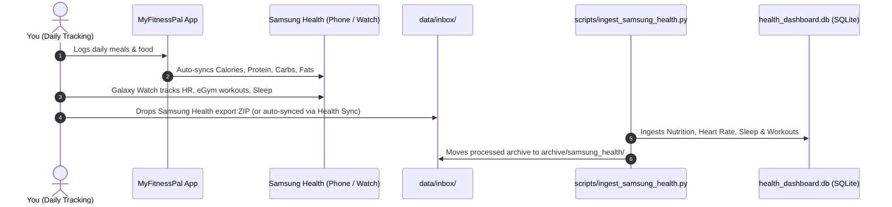

# Samsung Health & MyFitnessPal Integration Protocol

## 1. Overview

Because you use Samsung devices (Galaxy Phone / Galaxy Watch) and MyFitnessPal, Samsung Health acts as your central on-device health hub.

### Data Flow Architecture


---

## 2. What Samsung Health Captures for the Dashboard

1. **Nutrition (from MyFitnessPal):**
   - Total daily calories (kcal)
   - Protein (g) — evaluated against your target ($2.2\text{--}2.8\text{ g/kg}$)
   - Carbohydrates (g) — evaluated for glycogen saturation
   - Dietary fat (g)
   - Sodium, potassium, fiber, sugars
2. **Cardiovascular & Heart Rate (from Galaxy Watch):**
   - Continuous workout heart rate curves (eGym aerobic/anaerobic threshold tracking, peak 150 bpm)
   - Resting heart rate (75 bpm seated recovery metric)
3. **Sleep Architecture (from Galaxy Watch):**
   - Deep sleep duration (Delta-wave restorative sleep for CNS recovery)
   - REM sleep, light sleep, total sleep score
4. **Exercise & Active Energy Expenditure:**
   - eGym session duration and active calorie expenditure

---

## 3. How to Export Data from Samsung Health

### Option A: Manual Export (1 minute, anytime)
1. Open the **Samsung Health** app on your Samsung phone.
2. Tap the **Settings** gear (top right or in the menu).
3. Scroll down and tap **"Download personal data"**.
4. Confirm your Samsung account password/biometrics.
5. Once downloaded, send or copy the `.zip` file into:
   `/path/to/health-os/data/inbox/`
6. Run:
   ```bash
   python3 scripts/ingest_samsung_health.py
   ```

### Option B: Automated Sync via "Health Sync" App (Zero-Touch)
1. Install **Health Sync** from Google Play Store on your Samsung phone.
2. Configure **Source:** Samsung Health $\rightarrow$ **Destination:** Google Drive / Dropbox / Local folder.
3. Health Sync automatically writes daily CSV/JSON updates without manual exports.
